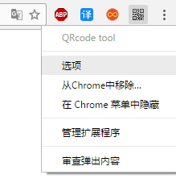

## QRcode-tool
一款简洁的二维码生成工具，Chorme 浏览器扩展工具。

## 功能

**生成当前标签页二维码**

点击浏览器地址栏右边的二维码小图标就可以生成当前页面地址二维码，手机扫码可以快速浏览当前标签页。

**生成自定义文本二维码**

在浏览器地址栏右边的二维码小图标上右键

点击`选项`即可打开配置页。

## 安装

克隆本项目到本地，拖拽项目里的 `QRcodeTool-v1.0.crx` 文件，到chrome浏览器的`扩展程序`即 `chrome://extensions/` 页面放开鼠标即可安装。

## 关于

开发目的：因为平时在电脑端需要发送些链接啊，或者文字到手机上时每次都要打开qq，特别是有时候电脑断网了，显得特别麻烦，所以开发了此插件。

本项目不定期更新，如有问题请Q我 `QQ:1752295326`。
